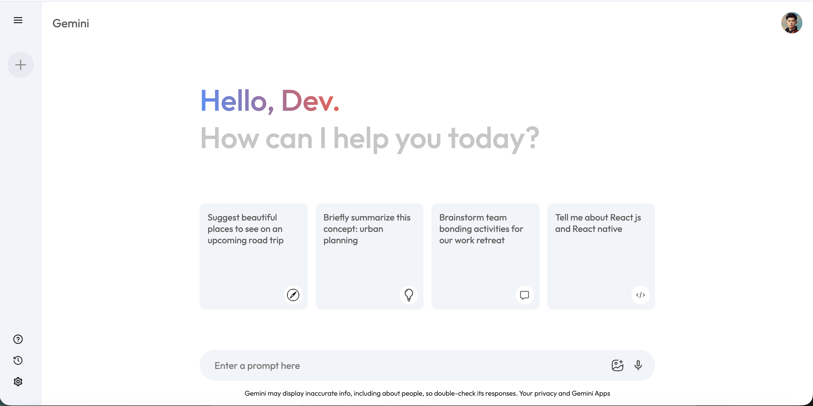
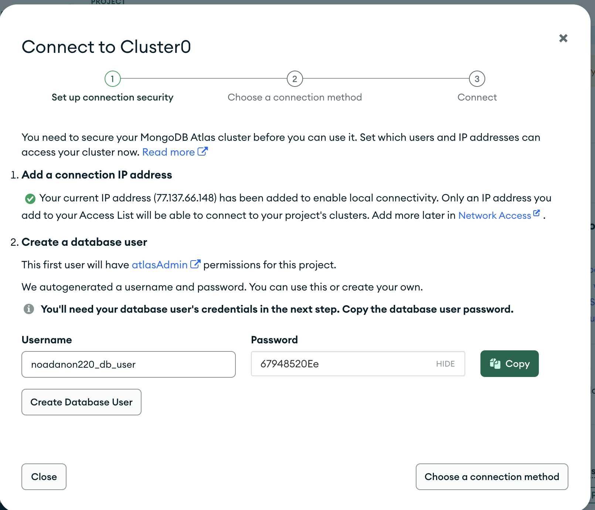
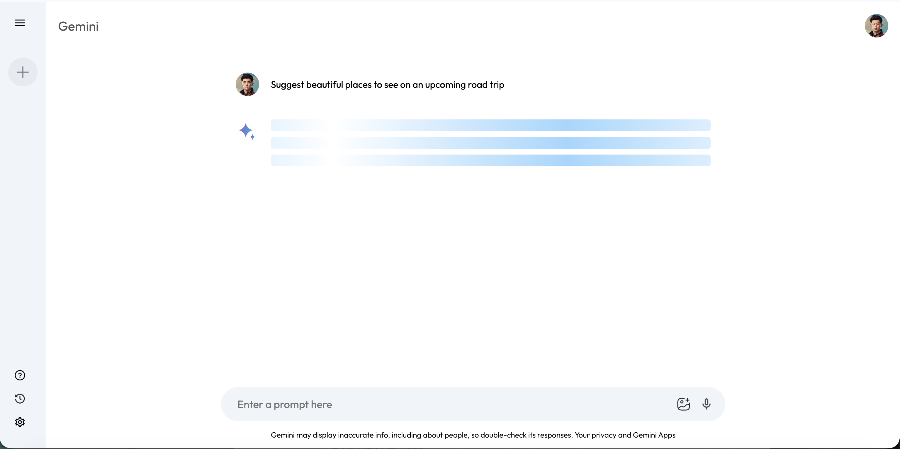

# Gemini Clone

A Google Gemini AI clone I built using React and the Gemini API. This was a fun project to learn about integrating AI APIs into web apps.

🔗 **Live Demo**: [https://gemini-clone-noa.vercel.app/](https://gemini-clone-noa.vercel.app/)

## Screenshots

<div align="center">

### Home Screen


### Chat Interface & Response Effect
 

</div>

### Demo Video

[🎥 Watch the demo video](https://github.com/noadanon220/gemini-clone/issues/6#issue-3655957614)

---

## What it does

This is a working chat interface that connects to Google's Gemini AI. You can ask it questions and get responses just like the real Gemini. I added some nice touches like a typing animation for responses and a sidebar to keep track of your chat history.

## Features

- Clean chat interface with greeting screen
- Sidebar that shows your previous questions
- Click on any old question to see its response again  
- Typing effect when the AI responds
- New chat button to start over
- Works on mobile and desktop
- Send button only shows up when you've typed something

## Tech Stack

- React
- Vite
- Gemini API
- Context API for state management

## Getting it running

You'll need Node.js installed. Then:

1. Clone this repo
```bash
   git clone https://github.com/noadanon220/gemini-clone.git
   cd gemini-clone
```

2. Install packages
```bash
   npm install
```

3. Get a Gemini API key from [Google AI Studio](https://aistudio.google.com/app/apikey)

4. Create a `.env` file in the root folder and add your key:
```
   VITE_GEMINI_API_KEY=your_key_here
```

5. Start it up
```bash
   npm run dev
```

Open `http://localhost:5173` and you should see it running.

## Project Structure
```
src/
  ├── components/
  │   ├── Main/         - main chat area
  │   └── Sidebar/      - navigation and history
  ├── config/
  │   └── gemini.js     - API setup
  ├── context/
  │   └── Context.jsx   - manages app state
  └── assets/           - icons and images
```

## Important Note

Don't push your `.env` file to GitHub! It's already in `.gitignore` but just making sure you know.

## Things I learned

- How to work with AI APIs
- Managing global state with Context API
- Building responsive layouts
- Handling async operations in React

---

Made by [Noa Danon](https://github.com/noadanon220)

